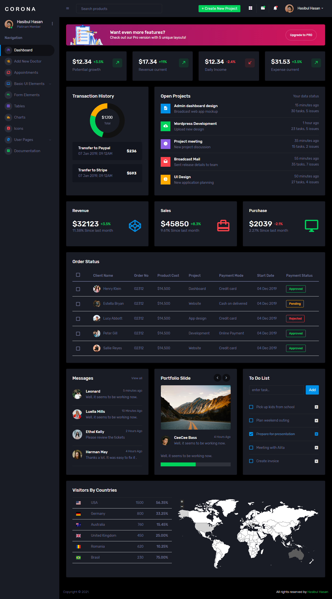
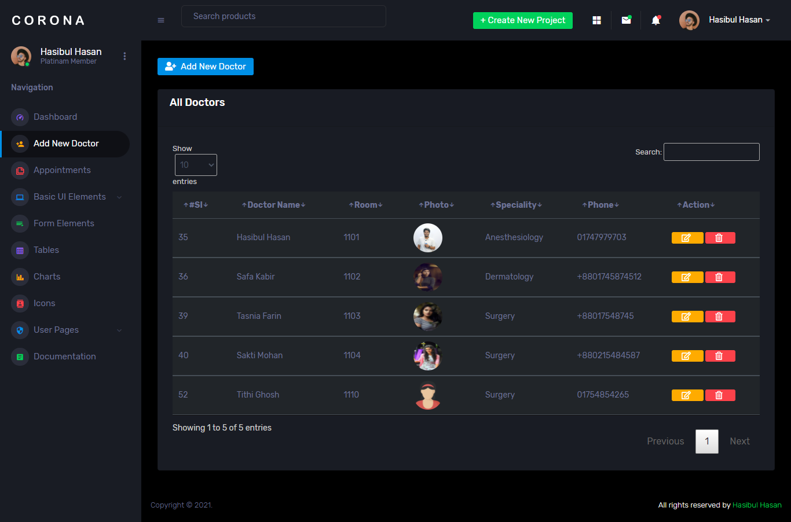
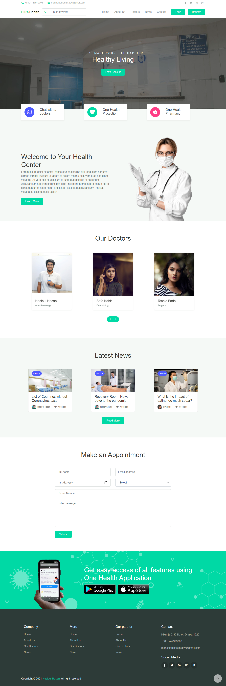
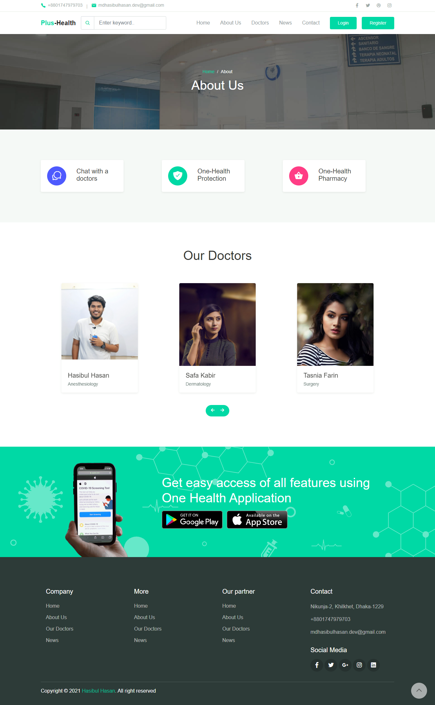
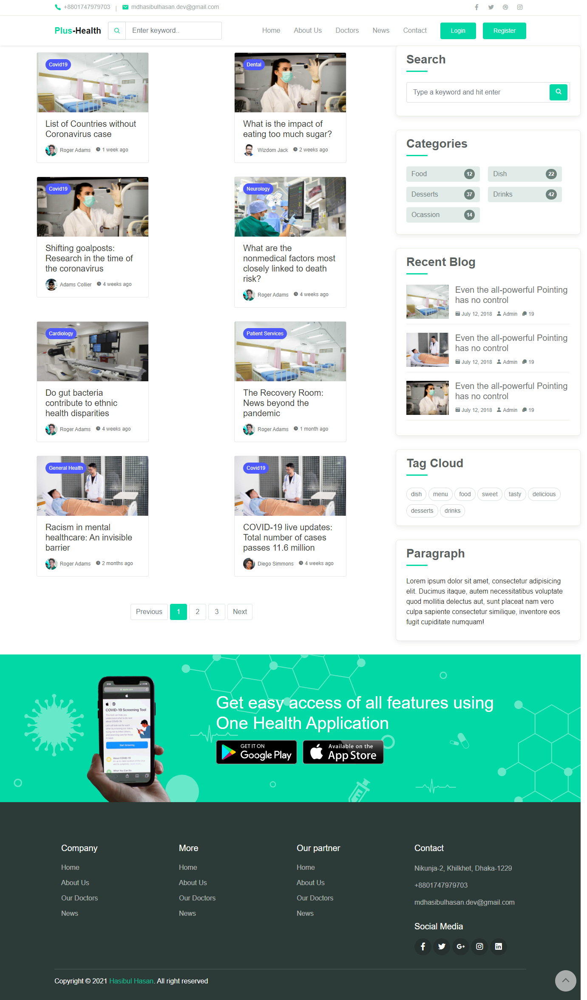
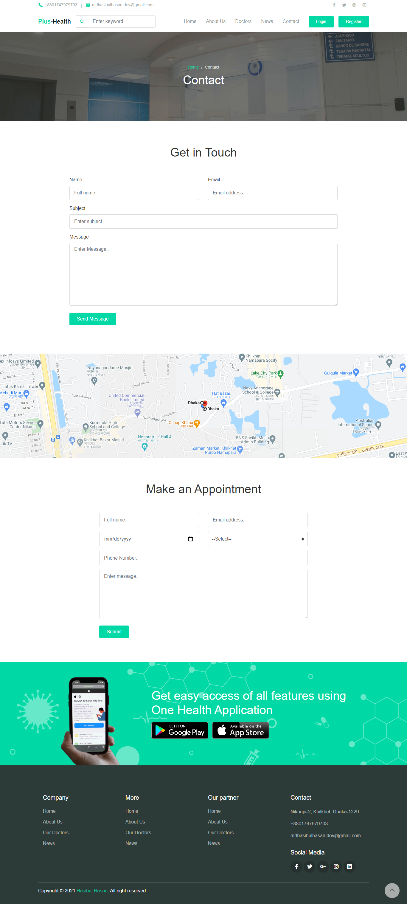

## Doctors Appointment can do
<ul>
    <li>Can request for doctor appointment</li>
    <li>Can delete appointment</li>
    <li>Can add,delete,update doctors</li>
    <li>Email authentication</li>
    <li>Email notification and many more...</li>
</ul>

## Using
<ul>
    <li>Laravel Framework 8</li>
    <li>JS, Ajax, jQuery, AlertJS, Sweet Alert2, DataTables, BootStrap5, FontAwesome, MUI etc.</li>
    <li>HTML, Blade Template</li>
    <li>PHP, MySQL and more...</li>
</ul>

#### Admin Dashboard

#### Home

#### About us

#### News/Blog

#### Contact us 

